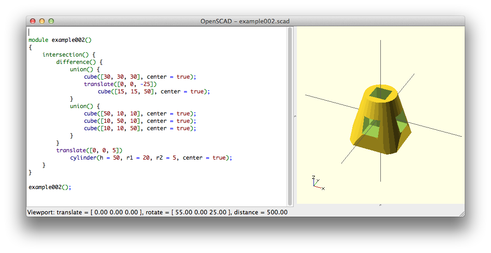
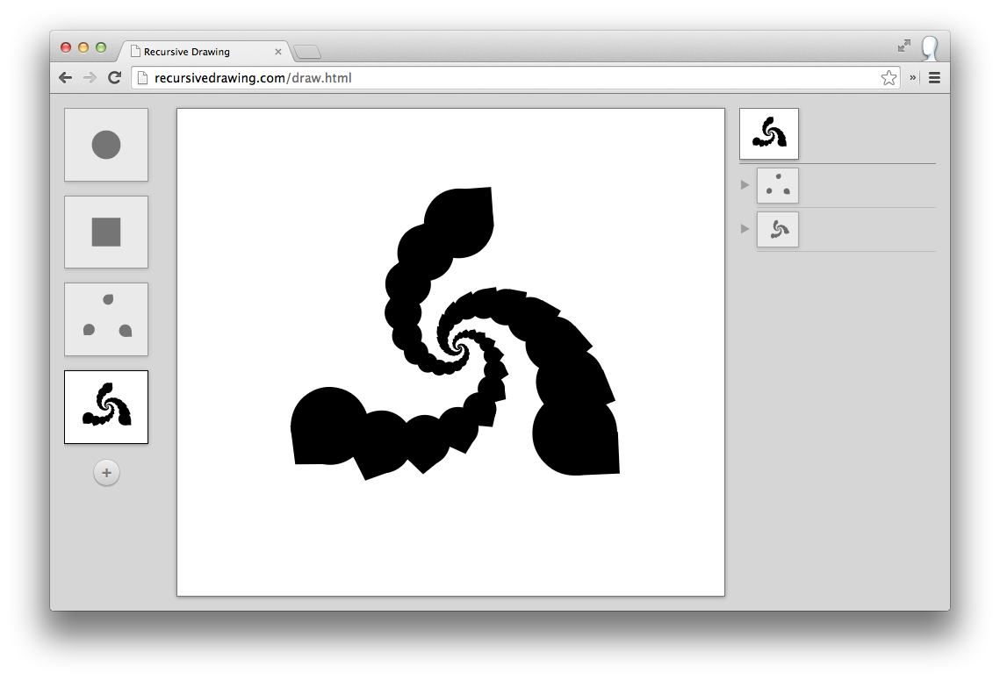
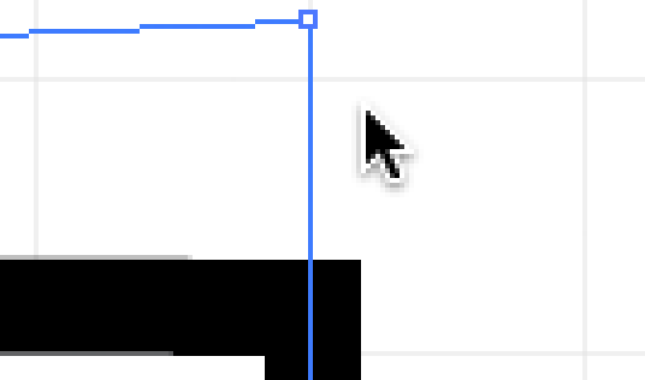
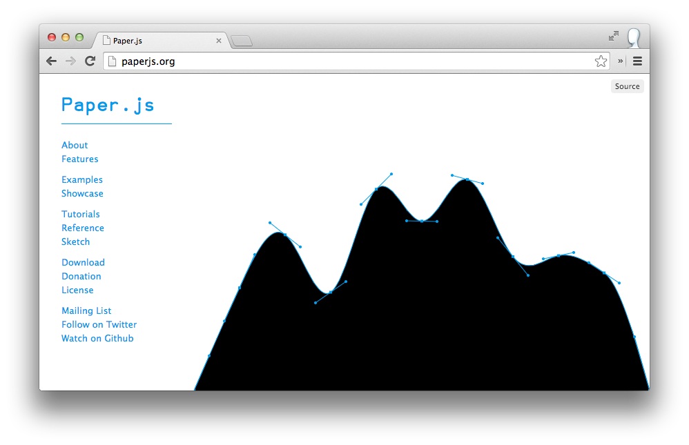

# Hello

A couple of months ago Brand New School did a physical interface project for Herman Miller. We went from concept to final installation in three weeks. To get it done fast we used a variety of prototyping technologies including 3D Printing, Laser-cutting, and the Arduino. I was going to do the presentation on how we used these technologies in the project, but Greg said "all that junk" was "old news".

So then I was going to do a presentation on how cool it is that all that junk is old news. But greg said that wasn't a good idea either.

Then Mike said to present "something that you’re excited about RIGHT NOW and which you’ve done some recent work in that no one has seen publicly."

At that momemnt I was thinking about better ways to design combs.

---

# Designing a Comb

Say you wanted to make a laser-cut comb. First you have to design and draw the shape of the comb. Then you have to clean up your drawing and prep it for cutting. After you laser-cut your comb, you might need to go back and change your design. What tool do you use to design your comb?

---

> Some people, when confronted with a problem, think "I know, I'll use Illustrator."
>
> Now they have two problems.

Appologies to [Jamie Zawinski](http://www.jwz.org/), [et al.](http://regex.info/blog/2006-09-15/247)

---

## A Comb in Illustrator


Step one is to design and draw the shape of the comb. Illustrator is _pretty alright_ for this, and you can draw up a frist pass of your comb fairly easily. Preparing your file for printing isn't always straight forward and making changes to your comb can be downright hard. Illustrator is not _really_ the right tool for the job.

- Changing the number of teeth is difficult.
- Changing the shape of the teeth is difficult.
- If you make your comb longer, Illustrator will stretch the teeth instead of adding more, and the rounded corners will be distorted.
- Many of Illustrator's tools are concerned with style in a way that doesn't map to laser cutting or plotting.
- Some tools in Illustrator are distructive, making changes sometimes requires starting over.

Illustrator does have some interesting tools like symbols and patterns. While clever use of these tools can help with the problems above, Illustrator isn't well suited this kind of paremetric, techincal work.

Illustrator isn't the only option out there, and I'm sure some CAD software packages are much better at this sort of thing.

---


# Inspirations

---

## OpenSCAD



- [OpenSCAD](http://openjscad.org/) is a scripting language and tool for creating 3D models with code.
- A great way to design a part for 3D printing.
- The underlying technology for [customizable](http://customizer.makerbot.com/docs) things on [Thingiverse](http://www.thingiverse.com/).
- A good model for how i'd like to design a part for 2D printing.

---

## Recursive Drawing


- [Recursive Drawing](http://recursivedrawing.com/) is an interface experiment by [http://tobyschachman.com/](http://tobyschachman.com/)
- Allows you to create a library of drawing elements and compose them easily.
- Elements can contain themselves.


---

##Illustrator



- [Illustrator](http://www.adobe.com/products/illustrator.html) is a powerful tool, but not right for the job
- Snap to grid: design is broken; implementation is buggy


---

##HTML/CSS

```HTML
	<h1>Hello World</h1>
	<style>
	h1
	{
		width: 200px;
		margin: auto;
	}
	</style>
```

- [HTML and CSS](https://developer.mozilla.org/en-US/docs/Web) are for making webpages.
- Provides tools for creating responsive/parametric 2D layouts
- Workflow based on source code rather than interactive GUI


---

##YAML

```yaml
invoice: 34843
date   : 2001-01-23
bill-to: &id001
    given  : Chris
    family : Dumars
    address:
	lines: |
	    458 Walkman Dr.
	    Suite #292
	city    : Royal Oak
	state   : MI
	postal  : 48046
```

- [YAML](http://www.yaml.org/) is a human friendly data serialization format.
- Easy for humans to read and write
- Library support for many languages
- Suprisingly powerful features


---

##Paper.js




- [Paper.js](http://paperjs.org/) is a JavaScript library for vector graphics.
- Full set of tools for creating static, animated, and interactive vector graphics.
- Supports boolean operations

---

# Introducing CombScript
## The BEST Way to Design a Comb

IMG identity logo

---

IMG Show CombScript Editor App
Simple Example

---

Big Example:
Parameterized Box


---

## CombScript Goals

- Parametric
- Expressive
- Declarative
- Unstyled
- Renders to SVG

---

## CombScript Editor

- Uses powerful ACE editor
- Highlights relationship between code and output
- Provides feedback on problems in your CombScript
- Provides shape inspector

---

## Feature Tour

- Variables
- Symbols
- Boolean Operations
- Mixed Boolean Operations
- Region Grid
- Export
- Documentation

---

# Introducing Sutton
## The BEST Way to Write on a Comb

IMG Sutton Specimen

---

- Built from lines instead of shapes
- Cuts plots faster and cleaner
- Monospace
- Designed by Greg


----

## Road Map

- More Powerful Exports
- Simple Math
- Rethink YAML


----

# Goodbye
combscript.com


-	Declaritve progamming
-   Browser based

much smaller than illustrator
been doing some lasercutting for the drawbot/other projects
doing some drawings with the drawbot
using illustrator to tool paths
wmarkanted to make something better
(accurate parameterized svg)
